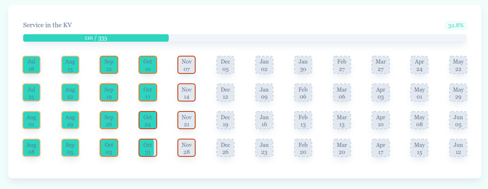

# Eleven Mikes 🪖 
_Tool to track the 11 months of service in the millitary_



### Setup

To download dependencies and setup docker containers run:
```bash
docker-compose up --build
```

After that you can just run this for development:
```bash
docker-compose up
```


